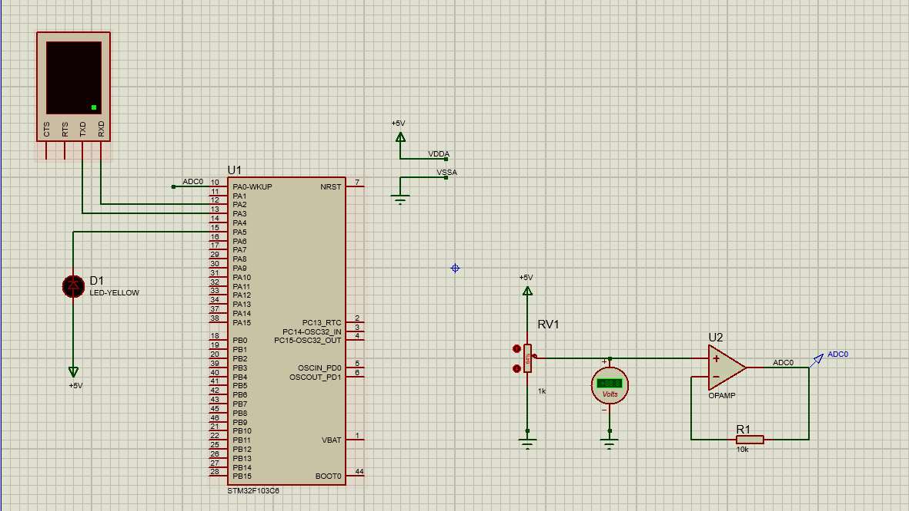
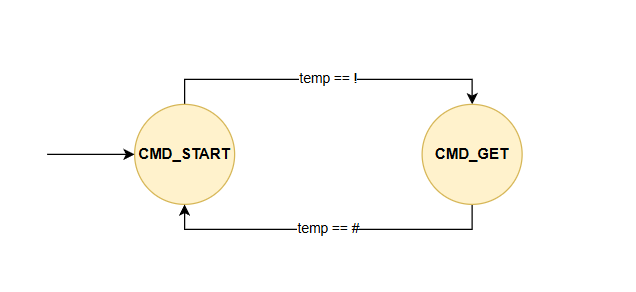
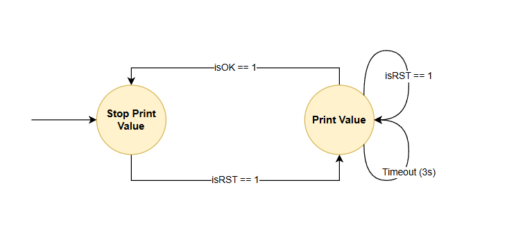

# MICROCONTROLLER - MICROPROCESSOR  
## CO3009_LAB5_UART
## 1. Introduction
Hi everyone, this is the README file for the CO3009_LAB5_UART project. This project implements UART communication between an STM32 microcontroller and a simulated terminal (Proteus Virtual Terminal). The system uses a simple protocol: the terminal requests sensor data with !RST#, the STM32 responds with the ADC value, and the terminal acknowledges with !OK#. The design ensures reliable communication using state machines and a timeout mechanism for retransmission.

## 2. Video Demonstration

## 3. Schematic

Main components:
- `STM32 Microcontroller` : The core of the system, responsible for handling UART communication and ADC readings.
- `Proteus Virtual Terminal` : Simulates a terminal for sending and receiving UART messages.
- `Variable Resistor (RV2)` : Acts as an analog sensor input for the ADC.
- `Voltmeter (for debugging)` : Displays the ADC value read by the STM32.
- `OP-AMP` : Used to design an ADC input signal, which is connected to pin PA0 of the MCU.

**Note:** 
- Set virtual terminal's baudrate to 9600, 8 data bits, no parity and 1 stop bit.

## 4. Configuration in STM32CubeIDE

### UART (USART2): 
- Set to 9600 baud, 8 data bits, no parity, 1 stop bit. Then enable interrupts for RX.

<p align="center">
  
</p>

### ADC Input:
- Configure channel 0 (PA0) for single conversion mode.


## 5. FSM Diagram
### Command Parsing FSM


The FSM has two states:
- `CMD_START`: Waits for the start character '!' to begin command parsing. Ignores noise before a command.

- `CMD_GET`: Collects command bytes, checks for valid commands (RST#, OK#) when '#' is received.
* **Note:** In virtual terminal environments for embedded systems, the `Backspace` key is generally not supported. As a result, any typing error requires re-entering the entire command. In my implementation, however, the Backspace character has been properly handled to improve user input flexibility.

### UART Communication FSM


The FSM has three states:
- `INIT`: Initializes FSM, transitions to stop_print_value state.
- `STOP_PRINT_VALUE`: Waits for !RST# command from terminal. On receiving, transitions to PRINT_VALUE state.
- `PRINT_VALUE`: Reads ADC value, sends it to terminal, waits for !OK# command. The timeout for waiting the !OK# is 3 seconds. 

## 6. Implementation Details
In this lab, a simple communication protocol is implemented as follows:
- From the console, user types `!RST#` to ask for a sensory data.
- The STM32 response the ADC_value, following a format `!ADC=1234#`, where 1234 presents for the value of ADC_value variable.
- The user ends the communication by sending `!OK#`
- The timeout for waiting the `!OK#` at STM32 is 3 seconds. After this period, its packet
 is sent again. The value is kept as the previous packet.

* **Notes:**
- UART:  Configured to operate at 9600 baud rate, 8 data bits, no parity, and 1 stop bit.
- ADC: The default ADC in STM32 is `13 bits`, meaning that `5V` is converted to `4096` decimal value. If the input is `2.5V`, ADC_value is `2048`.

## 7. Code Structure
```text
Core/
│
├── Src/                        # Main embedded source code
│ ├── main.c                    # Entry point, main application logic
│ ├── fsm.c                     # FSM logic for command parsing and UART communication
│ ├── stm32f1xx_hal_msp.c       # HAL MSP initialization
│ ├── stm32f1xx_it.c            # Interrupt handlers
│ ├── syscalls.c                # System call stubs
│ ├── sysmem.c                  # System memory allocation
│ └── system_stm32f1xx.c        # System clock and configuration
│
├── Inc/ # Header files for each module and main
│ ├── main.h                    # Common application definitions
│ ├── fsm.h                     # FSM function and state definitions
│ ├── stm32f1xx_hal_conf.h      # HAL configuration
│ ├── stm32f1xx_it.h            # Interrupt handler definitions
│
├── Startup/
│ └── startup_stm32f103c6ux.s   # Startup assembly code
│
├── Drivers/
│ ├── CMSIS/                    # ARM Cortex Microcontroller Software Interface Standard
│ └── STM32F1xx_HAL_Driver/     # STM32 HAL driver source and headers
│
├── Image/                      # Schematic and simulation screenshots
│
├── LAB5_UART.ioc               # STM32CubeMX project configuration file
└── README.md                   # Project documentation

```


